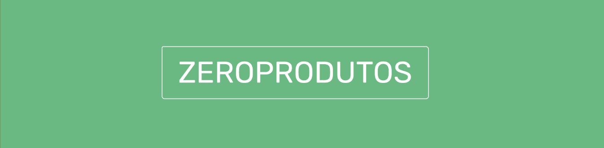

<i><h6>Projeto final feito pelo grupo Zeréssimos como requisito parcial da disciplina Desenvolvimento Web, da Residência de Software do Serratec.</h6></i>

<a name="back-to-top">

 

    <h2 align="center">
    Avocado Store o App com ZeroFuncionalidade.
    </h2>
  
 
   

  ## 🥑    Projeto Final
&nbsp;&nbsp;&nbsp;&nbsp;&nbsp;&nbsp;**ZEROPRODUTOS**    [*(Enunciado)*](./assets/doc.md)

  
✔️ Pré-requisitos do trabalho:

      

        CRUD - (GETbyID, GETALL, POST, PUT, DELETE) Usabilidade Organização do Código Navegação - (Stack Navigation) Apresentação.
      

  
 
  

  
✔👮 Obrigatório:

      

        Requisições HTTP - (CRUD) Navegação - (Stack Navigation) Uso de Hooks - (No mínimo os básicos: useState, useEffect, useContext) Reaproveitamento de componentes (Ex: Buttons, Inputs etc)
      

  

   

  
⚡️ Desafios:

      

        SplashScreen  
        Responsividade - (No mínimo celular deitado)  
        Navegação - (Usar outro tipo de navegação sem ser a Stack) 
      

  
  

#### Usuários teste
* Cliente:
  - user: admin
  - senha: zero
###### *Para outros usuários, consultar API.* 

## 🍃    API Consumida
 * [**Avocado API**](https://api-avocado.herokuapp.com/)
     
 
##     Tecnologia Utilizada
- [**Axios**](https://www.npmjs.com/package/react-axios)    [(*Documentação*)](https://www.npmjs.com/package/react-axios)
- [**CSS**](https://www.w3.org/Style/CSS/)    [(*Documentação MDN*)](https://developer.mozilla.org/en-US/docs/Web/CSS/Reference)
- [**Expo**](https://docs.expo.io/)    [(*Documentação*)](https://docs.expo.io/guides/)
- [**JavaScript**](https://www.javascript.com/)    [(*Documentação MDN*)](https://developer.mozilla.org/pt-BR/docs/Web/JavaScript)
- [**React Native**](https://reactnative.dev/)    [*(Documentação)*](https://reactnative.dev/docs/getting-started)    [(*Documentação MDN*)](https://developer.mozilla.org/pt-BR/docs/Learn/Tools_and_testing/Client-side_JavaScript_frameworks/React_getting_started)
- [**React Navigation**](https://reactnavigation.org/)    [(*Documentação*)](https://reactnavigation.org/docs/getting-started/)
- [**Visual Studio Code**](https://code.visualstudio.com/)    [*(Documentação)*](https://code.visualstudio.com/docs)
 - [**Yarn**](https://yarnpkg.com/)    [(*Documentação*)](https://yarnpkg.com/getting-started) 
  

© 2021 Copyright: zeressemos.com

Sambando na cara das inimigas desde 2021

 

   

<table>
  <tr>
    <td align="center">
      <a href="https://github.com/raiocodrigues">
         
        
          <b>Caio Rodrigues</b>
        
      </a>
    </td>
    <td align="center">
      <a href="https://github.com/FredericoStilpen">
         
        
          <b>Frederico Stilpen</b>
        
      </a> 
    </td>
    <td align="center">
      <a href="https://github.com/M4G1Ck">
         
        
          <b>Gabriel Macedo Araújoo</b>
        
      </a> 
    </td>
    <td align="center">
      <a href="https://github.com/JpBade">
         
        
          <b>João Paulo Bade</b>
        
      </a> 
    </td>
    <td align="center">
      <a href="https://github.com/marcosbarker">
         
        
          <b>Marcos Paulo Marques Corrêa</b>
        
      </a> 
    </td>
    <td align="center">
      <a href="https://github.com/Volneineves">
         
        
          <b>Volnei Neves</b>
        
      </a> 
    </td>
</table>
 

&emsp;&emsp;&emsp;&emsp;&emsp;&emsp;&emsp;&emsp;&emsp;&emsp;&emsp;&emsp;&emsp;&emsp;&emsp;&emsp;&emsp;&emsp;&emsp;&emsp;⬆️[**Back to top**](#back-to-top)⬆️